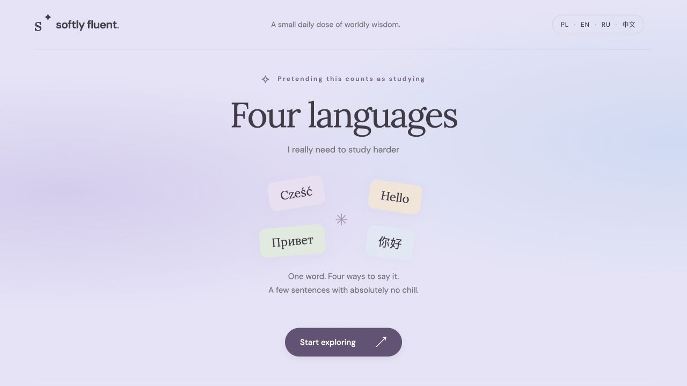

# Softly Fluent

A small personal project to help me study languages regularly and build a consistent learning habit.

Explore Polish, English, Russian and Mandarin Chinese side by side, with example sentences, pinyin and a little humour. A soft lavender-blue design keeps studying light and approachable.

[Try the website](https://softly-fluent.netlify.app/)




## Features

- Random vocabulary without repeats until the collection is exhausted.
- Four translations and example sentences, plus Mandarin pinyin.
- Progress saved locally in the browser.
- Responsive design, built with HTML, CSS and JavaScript.

## Run locally

```sh
python3 -m http.server 8000
```

Open `http://localhost:8000`. No installation or API keys required.
