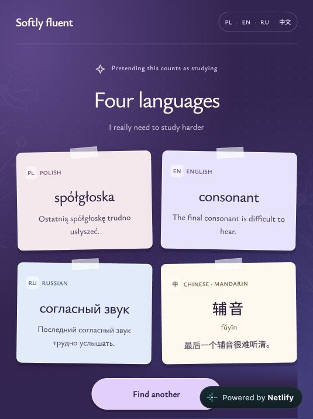

# Softly Fluent

A small personal project to help me study languages regularly and build a consistent learning habit.

[Link to the website](https://softly-fluent.netlify.app/)



## Features

- Random vocabulary without repeats until the collection is exhausted.
- Four translations with everyday examples and Mandarin pinyin.
- Animated vocabulary cards and a button that cycles through four languages.
- Progress saved locally in the browser.
- Responsive design, built with HTML, CSS and JavaScript.

## Run locally

```sh
python3 -m http.server 8000
```

Open `http://localhost:8000`. No installation or API keys required.
